# Final Lesson: Learning the Basics by Game Development

## A: Pythonを学んで続きましょう
## Lesson Game: *Number Guessing Game*
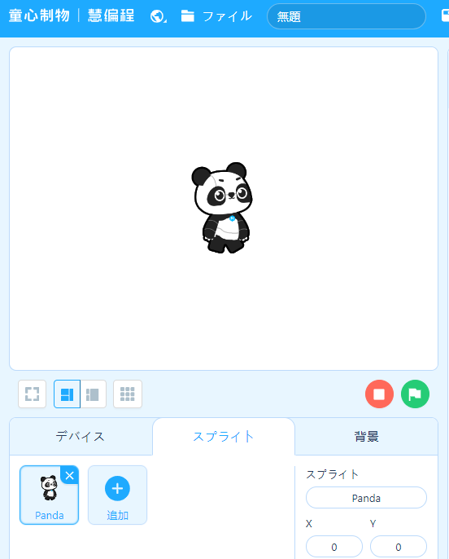
この設定そのまま

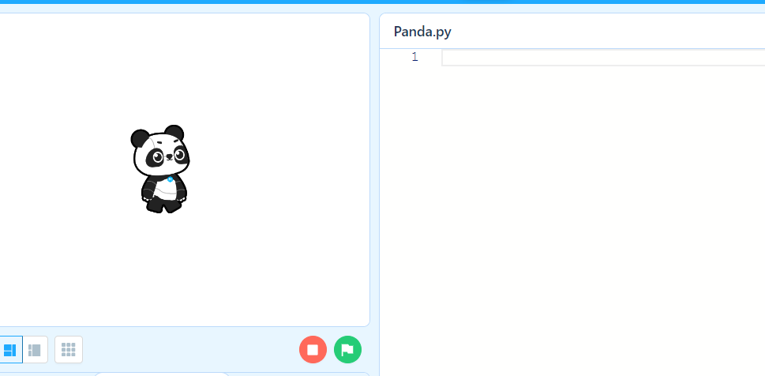
PythonのIDEで作りましょう！

### イベント：緑旗を押されたら。。。

### 1. イベントのモジュールをインポート
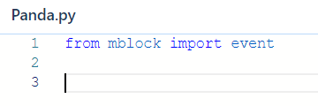

### 2. イベントマーカーを設定しましょう
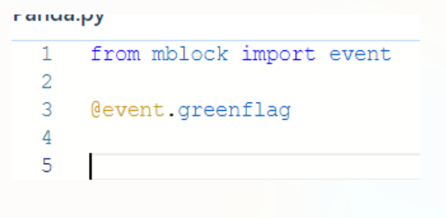

### 3. イベントの関数を作りましょう
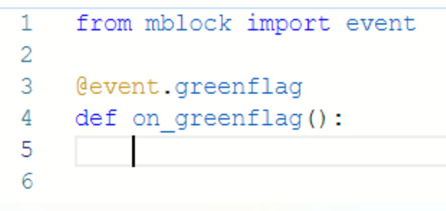

この関数内に全部のゲームプログラミングをやるつもりです。

### 4. 数字をゲット（乱数で）
**4a**
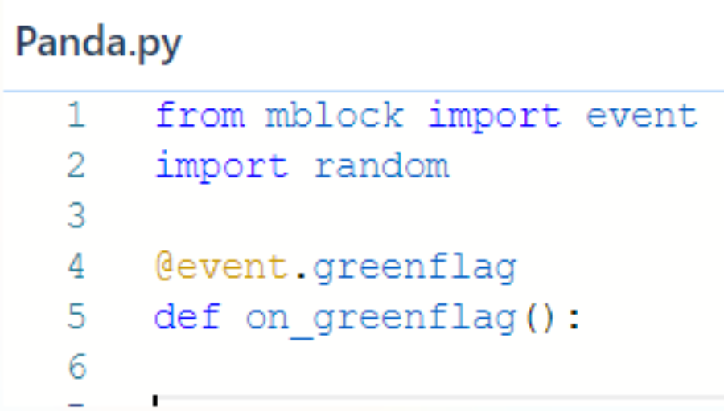

**4b**
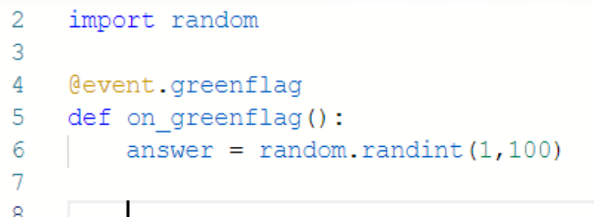

### 5. ゲームループを作りましょう
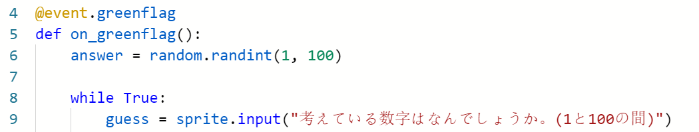

### 6. ループプログラミング
**意味：** ループの一番最初から戻る事
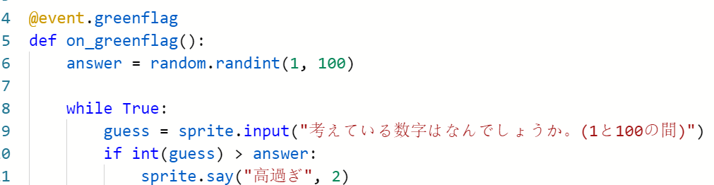

### 7. プログラミングを続きます
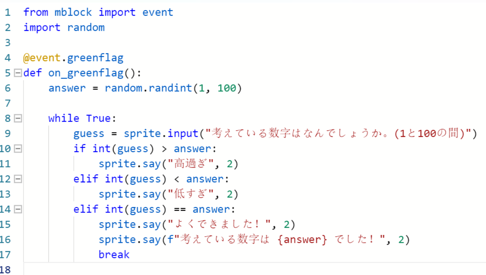


## ループのトリー
下の写メを見てください。
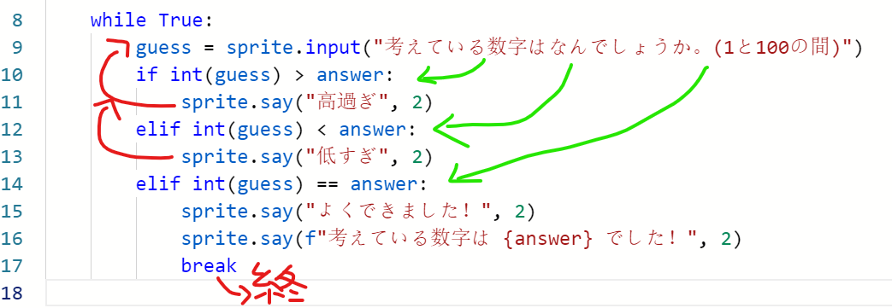

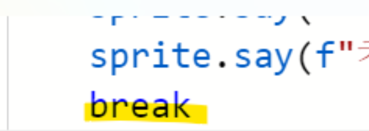
`break`を入れるとループは終了のことです。

### 8.　実行してください
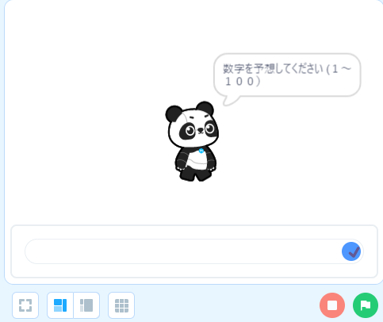
1. `実行`ボタンを押してから、
2. 緑旗をクリックすると

ゲームはスタートします！

---

## B. `random.choice`

### 1. コードは下記の写メと一緒までクリアしてください
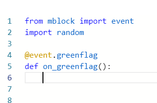

### 2. リストを作りましょう！
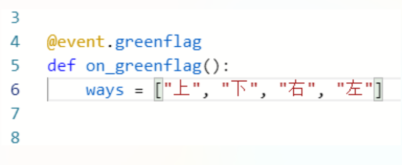

### 3. スプライトを参加しましょう！
`Game element15`を検索しください。

下記の写メと一緒に設定してください。

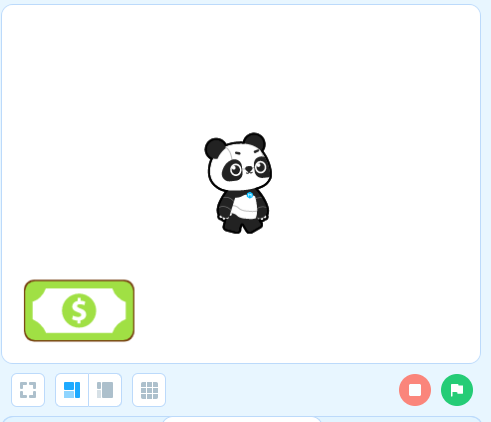

### 4. Pythonに戻りましょう。
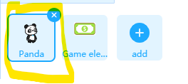

Pandaのコードが表示することを確認してください。

### 5. ゲームループを作りましょう！
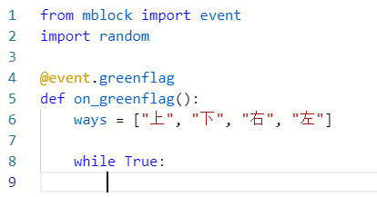

### 6. リストからランダムに選んで、選んだ方向へ行きましょう！
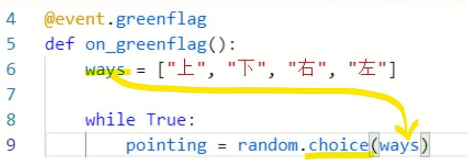

### 7. 方向をチェックして、そちらへ動きましょう！
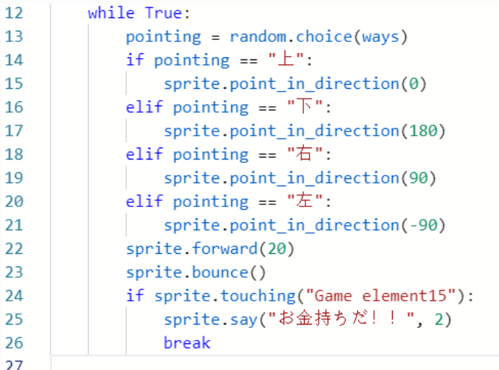

### 8. 旗をクリックのときにPandaを真ん中へ移動して、９０度方向にしましょう。
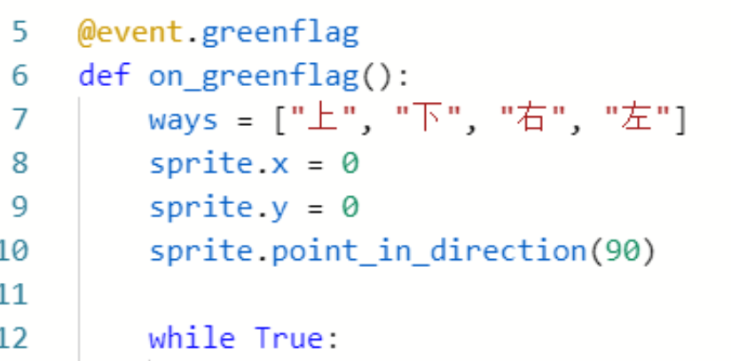

### 9. 実行してください
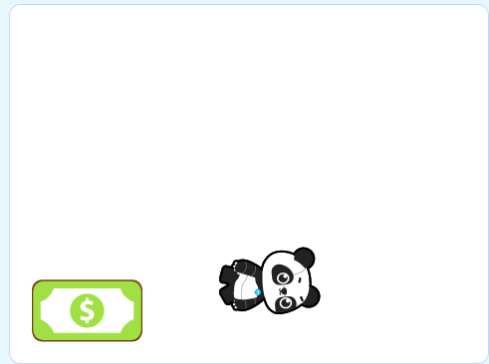

※急に動いていますね！

### 10. スピードダウンをさせましょう！

#### 10a. `import time`を使ってください
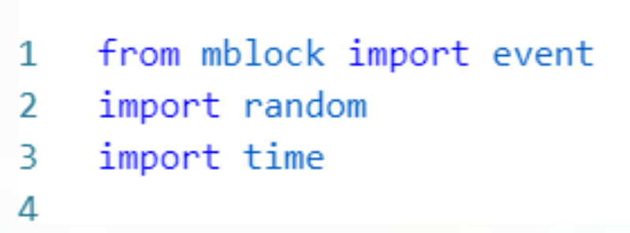

#### 10b. 0.5秒寝かせましょう
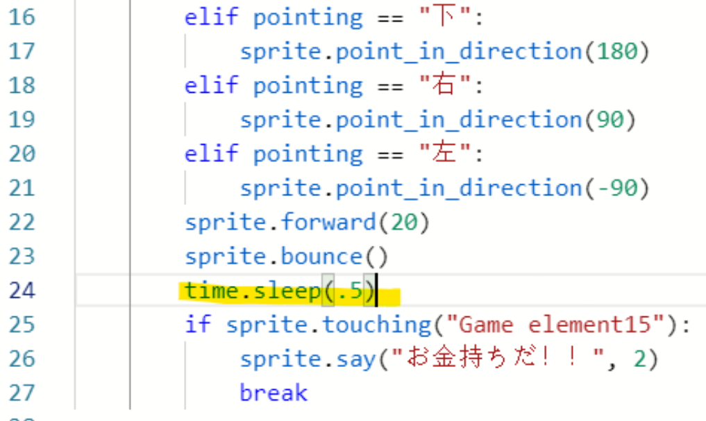

### 11. もう一度実行してください


※もう少しゆっくり動いていますね！

---
## C. 趣味を予想ゲーム

### 1. 全部をリセットしてください
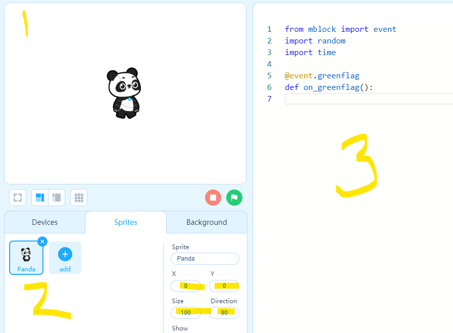

### 2. 趣味のリストを作ると答えを選びましょう
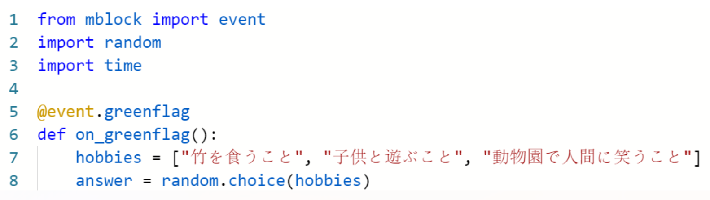

### 3. 全部のゲームを作りましょう
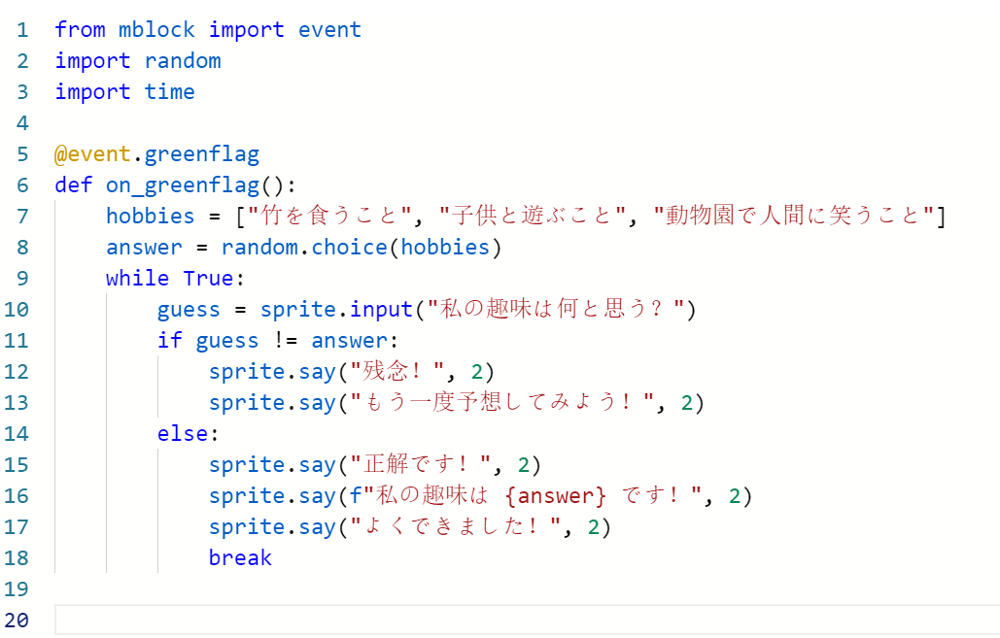

### 4. リストを見ながら遊んでみてください
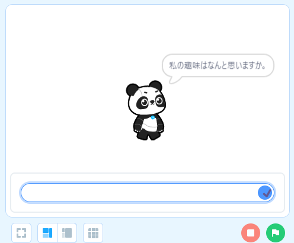

---

## 大事なポイント！
1. `f-string`の使い方

`f-string`とは `f"これは文字列に　{変数}　を追加できる"` 事です

例えば：
```Python
from mblock import event
import random

@event.greenflag
def on_greenflag():
    my_number = random.int(1, 100)
    sprite.say(f"私の数字は {my_number}", 2)
```
２秒で `my_number` を言います。


2. `random.choice()`
`random.choice`の中にリストを入ってください。例えば：

```Python
from mblock import event
import random

@event.greenflag
def on_greenflag():
    my_list = ["Japan", "America", "China"]
    my_country = random.choice(my_list)
    sprite.say(my_country)
```

`my_list`のリストを`random.choice()`の引数に使います。

下記もOKです!
```Python
from mblock import event
import random

@event.greenflag
def on_greenflag():
    my_country = random.choice(["Japan", "America", "China"])
    sprite.say(my_country)
```

3. `time.sleep()`で何秒停止すること
例えば：
```Python
from mblock import event
import random
import time

@event.greenflag
def on_greenflag():
    while True:
        sprite.point_in_direction(random.int(0, 359))
        sprite.move(10)
        time.sleep(.25)
```
この例で、スプライトは曲がってから１０歩「前」へ進みます。.25秒停止してからループが続きます

---
このレッスンを何回練習してください！

準備できたと思いましたら、最後のレッスンに進みましょう！