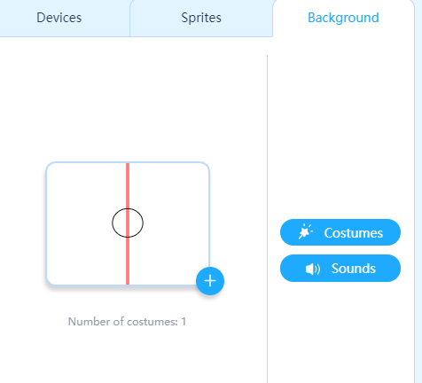
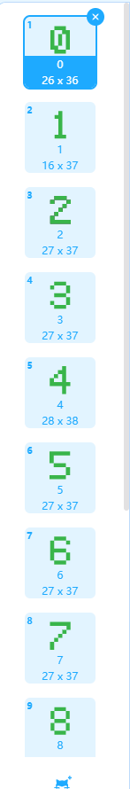
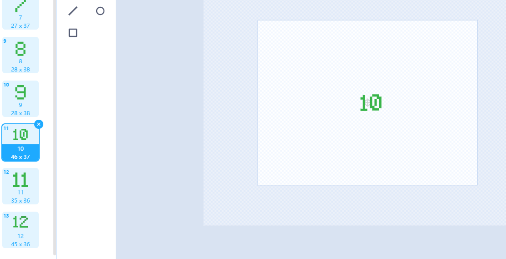

# Welcome to the Final Test!

For your final test in *Python from Scratch,* you'll be making a version of the classic game of ***Pong***!

For this test, you will need to create the following:

### Sprites

### Background

---
## A Look Inside
Let's take a look at some of the details of these objects.

### The Score GUI

To find these numbers:
1. Select a new costume inside of your sprite object
2. Search for your number (0 through 9)
3. Click on the last page of the search results
4. Click on the last image in the search results (`ZPixel-#`)
5. Make 13 of these (0 through 9, then design 10, 11, and 12 on your own)

### Modules Necessary for each Sprite

- `random`
- `event` from `mBlock`
- `time`

- `event` from `mBlock`
- `time`

- `event` from `mBlock`
- `time`

---
## Details

### Ball Behavior
1. The ball should bounce off of the top and bottom of the screen
2. If the ball makes it beyond the paddles, the opposite player scores
3. After a brief pause, the ball returns to center and flies off towards either of the paddles
   1. For this, use `random.choice(list)` 
   2. You will also need to use `time.sleep(seconds)` to get this function to work
   3. The ball should **not** bounce off of the left or right sides of the screen

### Challenge
Create a 2p version of this game.
- Blue on the right, red on the left
- Blue moves up and down with `w` and `s`
- Red moves up and down with `up arrow` and `down arrow`
- Game ends when a side gets 12 points
- The scoreboard should reflect your score accurately.
- Game ends when a player gets 12 points.

### Idea Map
| | | |
| --- | --- | --- |
|  | Add Sounds |  |
| Create an option to play vs.2p or vs.CPU | Game Complete | Red is a CPU Player
| | Add BGM | |

---
## Final Evaluation (Total Score: 100 Points, Passing is at 70)
**Teachers**: When evaluating the student's game and programming, award points in the following areas:

___ 1. Use of the textbook as a lifeline

___ 2. Application of ideas

___ 3. Final program defeats all challenges

___ 4. Controls are smooth and correctly assigned, as instructed

___ 5. All timing is good

___ 6. Game has no bugs

___ 7. Error-free at presentation

___ 8. Demonstrates a basic understanding of Python syntax (indentations, correct use of loops, etc.)

___ 9. Score transitions correctly

___ 10. Game over conditions are correctly met

___ Bonus 1 (Idea Map): Sounds are cued correctly (+5 Points)

___ Bonus 2 (Idea Map): Option given at start of the game (+10 Points)

___ Bonus 3 (Idea Map): BGM executes and timing is comfortable (Evaluate up to 10 points)

---

### Total Points: ___________ out of (Maximum Possible: 125)
Combined with bonus points, a final score at 80 or above passes the evaluation.