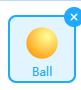

# 最終のテストにようこそ

Python from Scratchの最終テストは**PONG**を作ることです。


## 必要なもの

必要なものは以下のとおりです。

### スプライト


### 背景


---

## 細かい部分

細かい部分も確認しましょう。

### スコアのGUI(画面)


数字のスプライトの追加方法:

1. スプライトの中に新しいコスチュームを検索
2. ０～９を検索しましょう
3. 結果の最後のページをクリック
4. 最後のコスチューム4を選ぶ(`ZPixel-#`)
5. 自分で１０～１２を作る

### 全スプライトの必要なモジュール

各スプライトのスクリプトの最初に書きましょう。



```py
import random
from mBlock import event
import time
```


```py
from mBlock import event
import time
```


```py
from mBlock import event
import time
```

---

## 必要なプログラミングについて

### ボールの動き

1. 上と下のはしを触れたら跳ね返る
2. プレイヤーのパドルを通ったら、反対のプレイヤーのスコアは＋１点上がります！
3. 何秒一時停止後、ボールは真ん中に戻って、ランダムに右・左へ移動を始めます。
   1. `random.choice(list)`を使ってください
   2. `time.sleep(seconds)`も必要です
   3. 右左のはしに触れたら跳ね返らないように行動するべきです

### チャレンジ

２Pゲームを作りましょう

- 青は左、赤は右
- 青は `w`と`s`で上下に動く
- 赤は `up arrow`と`down arrow`で上下に動く
- どちらのプレイヤーは１２点できましたらゲームオーバーになります
- GUIでスコアを表示する

### アイディアマップ

| | | |
| --- | --- | --- |
|  | 効果音のプログラミング |  |
| ゲームを実行して、「vs.2Pあるいはvs.CPU」のオプション | **ゲーム終了** | 赤はCPU
| | BGMのプログラミング | |

---

## 採点： 合格点は８０点です

**講師へ**: 下記のリストが採点基準です。1つ満たすごとに10点加点します。100点満点+ボーナスがあります。

___ 1. わからないところを自力で調べることができている

___ 2. プログラミングへの理解がある

___ 3. ゲームは全部の基本チャレンジに合致している

___ 4. プレイヤーの挙動に問題なく快適にプレイできる

___ 5. ゲームのタイミングが変ではない

___ 6. バグがない

___ 7. 発表のときにエラーがない

___ 8. 基本のPythonの文法を理解している

___ 9. スコアは問題なく表示されている

___ 10. ゲームオーバーの場合のプログラミングが問題ない

___ ボーナス 1 (アイディアマップ): 効果音を追加した(+5点)

___ ボーナス 2 (アイディアマップ): オプションがきちんと実装されている(+10点)

___ ボーナス 3 (アイディアマップ): BGMを追加した(+10点)

---

### 合計: ___________ (最高得点: 125)

ボーナス点込みで80点が合格点です。
